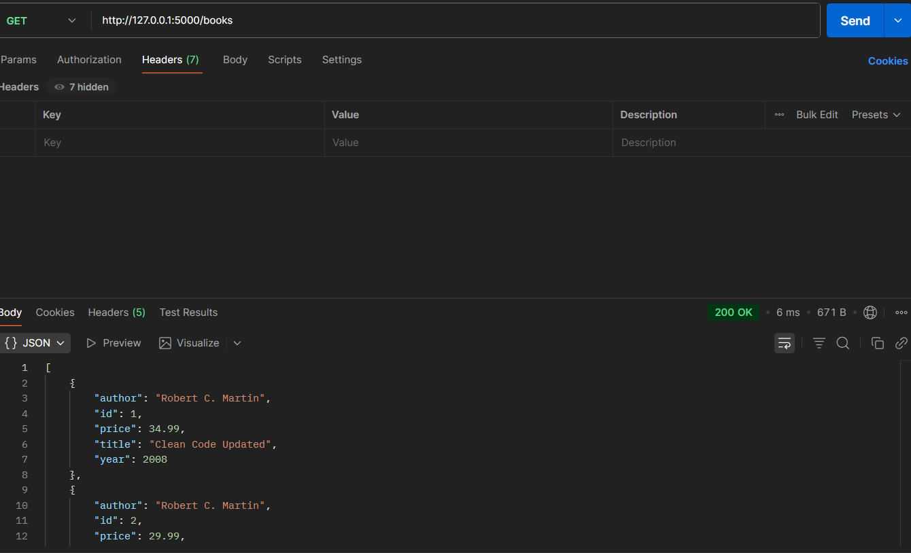
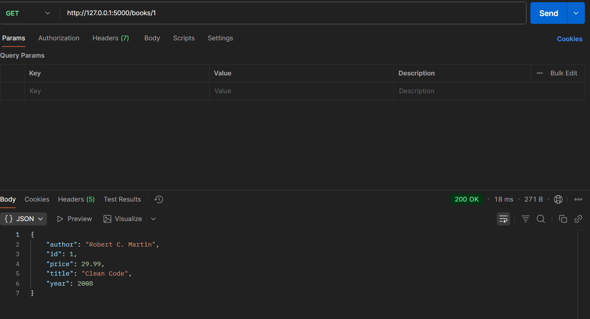
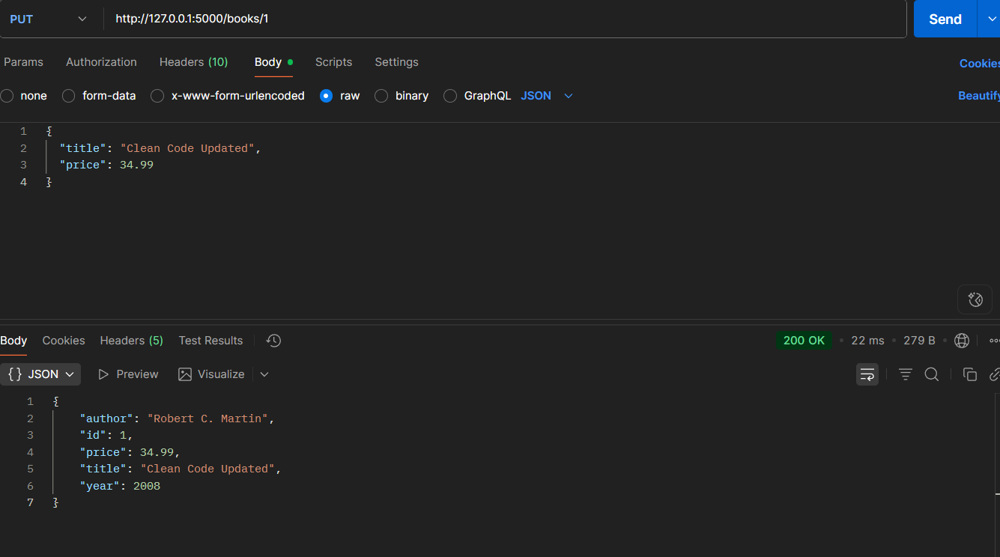
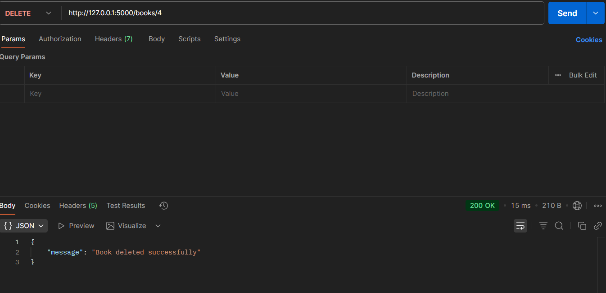

# Bookstore REST API (Flask)

A simple **REST API** built with **Flask**, **SQLAlchemy**, and **Marshmallow** to manage books in a bookstore.  
This project is part of the **Bookstore API** multi-language repo.

---

## Features

- Add a book (POST `/books`)  
- List all books (GET `/books`)  
- Get a book by ID (GET `/books/<id>`)  
- Update a book (PUT `/books/<id>`)  
- Delete a book (DELETE `/books/<id>`)  
- JSON responses for all endpoints  

---

## Tech Stack

- Python 3.10+  
- Flask  
- Flask-SQLAlchemy  
- Flask-Marshmallow + marshmallow-sqlalchemy  
- SQLite (default, can switch to MySQL/PostgreSQL)  

---

##  Structure

flask-version/
│── app.py # Main Flask app
│── models.py # Database models
│── schemas.py # Marshmallow schemas
│── add_books.py # Script to insert sample data
│── requirements.txt # Dependencies
└── README.md # This file


---

##  Setup & Run Install dependencies


```bash
python -m venv venv
venv\Scripts\activate   # Windows
# source venv/bin/activate  # Linux/Mac

```

## Install dependencies
```bash
pip install -r requirements.txt
```
## Run the app
```bash
python app.py
```
## Insert demo data
```bash
python add_books.py
```

### Example Request in Postman

**POST /books**


**GET /books**


**GET /books/id**


**PUT /books/id**


**DELETE /books/id**
